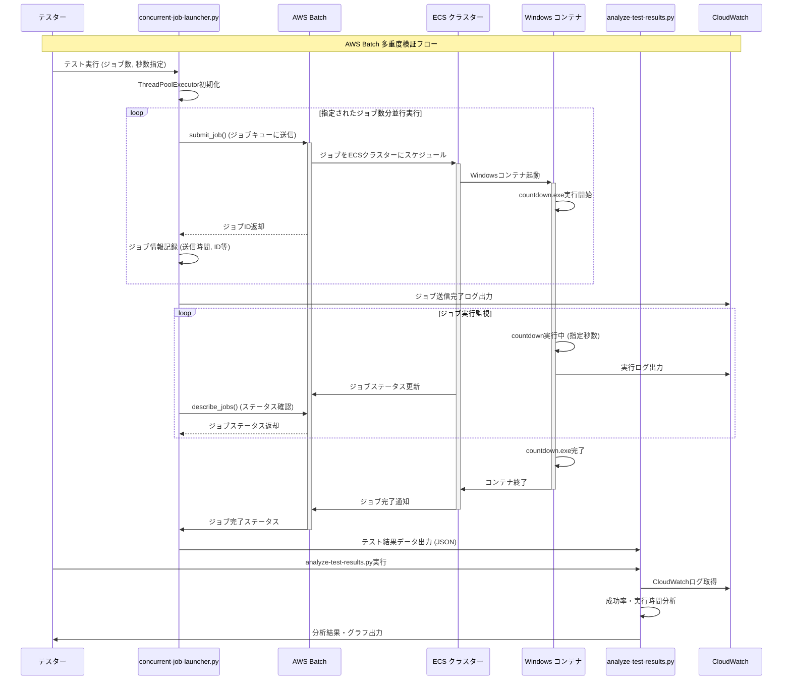
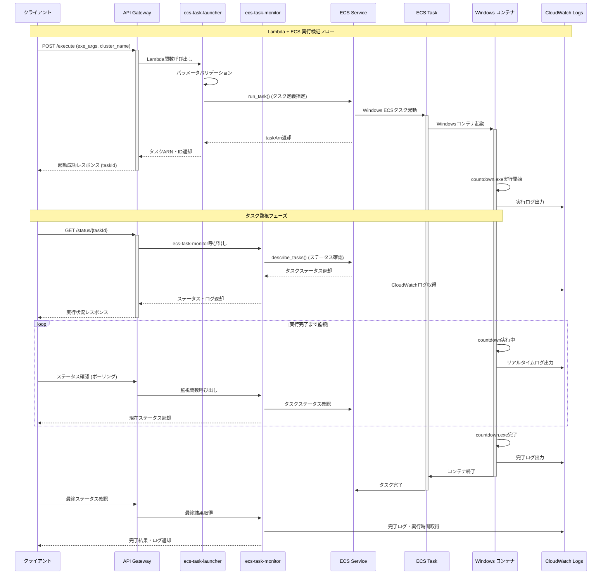
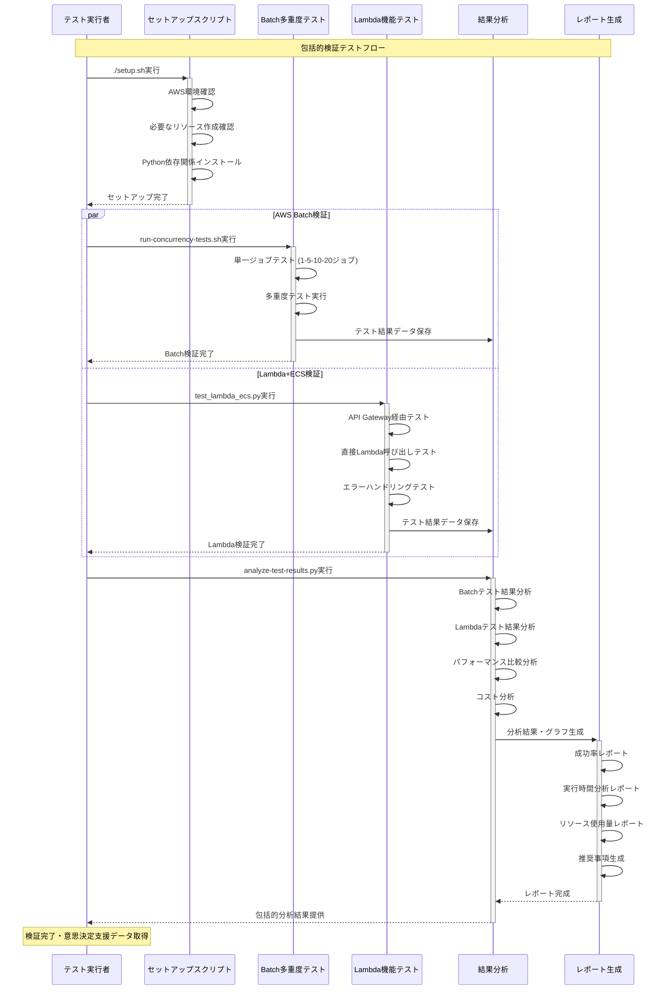
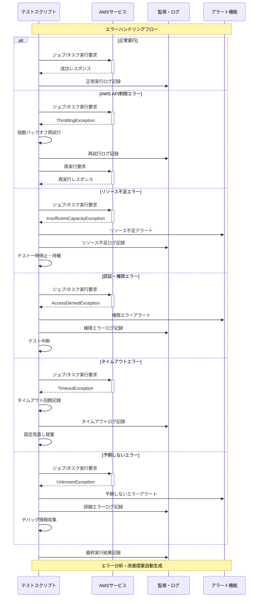

# 検証テストシーケンス図

このドキュメントでは、AWS上でのWindows EXEファイル実行検証のテストシーケンスをMermaid形式で表現しています。

## 1. AWS Batch 多重度検証テストシーケンス

## 2. Lambda + ECS 実行検証テストシーケンス

## 3. 包括的テスト検証フローシーケンス

## 4. エラーハンドリング・例外フローシーケンス

## シーケンス図の説明

### 1. AWS Batch 多重度検証
- 複数ジョブの並行送信とパフォーマンス測定
- ThreadPoolExecutorによる効率的な並行処理
- CloudWatchログによる実行状況監視

### 2. Lambda + ECS 実行検証
- RESTful API経由でのWindowsコンテナ実行
- リアルタイムステータス監視
- CloudWatchログによる詳細ログ収集

### 3. 包括的テスト検証
- 両アプローチの並行テスト実行
- 結果の自動分析・比較
- 意思決定支援データの生成

### 4. エラーハンドリング
- 各種AWS例外の適切な処理
- 自動再試行・回復メカニズム
- 詳細なエラー分析・ログ記録
